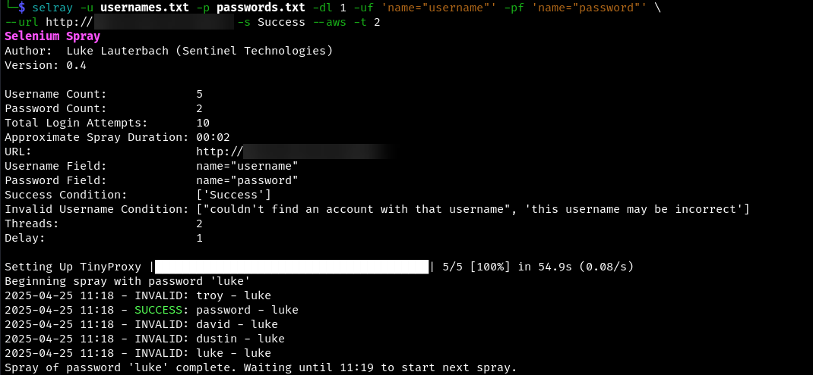

<p align="center">
  
</p>

<h1 align="center">Selray</h1>

<p align="center">
  <b>A flexible Selenium-based password spraying tool designed to evade common WAF detections.</b><br>
  <i>Selray = Selenium Spray</i>
</p>

## ✨ Features
- Bypasses WAFs by simulating real browser interactions
- Supports AWS proxy rotation to evade IP-based detections
- Handles complex login flows that require full form interaction
- Built-in delay system to avoid password lockout policies

## 📜 Description
Selray is a password spraying utility that leverages Selenium to avoid traditional web application firewall (WAF) detections, offering flexibility for targeting a variety of authentication portals.



## 🚀 Usage

### Examples
```bash
selray -u test@example.com -p Password1 -dl 1 -uf 'name="username"' -pf 'name="password"' --url https://example.com -s Success
```
This is the most basic usage. A single username and password will be attempted against the login portal, with all requests coming from the origin's IP address.

```bash
selray -u usernames.txt -p passwords.txt -dl 60 -uf 'name="username"' -pf 'name="password"' --url https://example.com -s Success --aws -t 10 -n 10
```
Spray multiple users contained in a file. Attempt multiple passwords from a file, with 60 minutes between each individual password, to avoid an account lockout. Use 10 AWS proxies to bypass IP-based restrictions, and ensure that no more than 10 login attempts ever come from the same IP address.

### Modes
Selray includes pre-made modes that simplify the process of spraying specific targets. Modes are available in the modes folder and are created using TOML files. Currently, modes are available for:
* Azure
* Google
* Outlook Web Access (still requires `--url`)

A mode can be specified with `-m {NAME}`

### Requirements
If no mode is specified, each run of the script requires four things:
- **`--url {URL}`** - URL of the website to spray.
- **`-u {USERNAME/S}`** – A username or file containing usernames. Optionally, a `username:password` list separated by a colon (e.g., `USER:PASS`).
- **`-p {PASSWORD/S}`** – A password or file containing passwords.
- **`-uf {USERNAME FIELD IDENTIFIER}`** – An HTML attribute unique to the username field you are trying to spray. In the example below, name="UserName" would be a valid value.
  ```html
  <input id="userNameInput" name="UserName" type="email" placeholder="someone@example.com" autocomplete="off">
  ```
- **`-pf {PASSWORD FIELD IDENTIFIER}`** – An HTML attribute unique to the password field. In the example below, name="Password" would be a valid value.
  ```html
  <input id="passwordInput" name="Password" type="password" placeholder="Password" autocomplete="off">
  ```

You must also specify either:
- **`-f`** – Text present after a failed login, or
- **`-s`** – Text present after a successful login.

### Options
- **`-t {INTEGER}`** – Number of concurrent login attempts (default: 5)
- **`-dl {INTEGER}`** – Delay (in minutes) between password sprays (default: 30)
- **`-i`** – Text that will be displayed on the page if the username is invalid (comma separated, if multiple)
- **`-l`** - Text that will be displayed on the page if the account is locked out (comma separated, if multiple)
- **`-nh`** - No Headless. By default, Selray will use a headless browser. However, some web applications don't like headless browsers and a headful browser can be helpful for troubleshooting. This option will turn headless mode off. Note, the pop up windows will be very invasive.
- **`-cb`** – Checkbox attribute selector, if you want to have a checkbox on the login page checked. Works the same as `-uf` and `-pf`.
- **`-d {DOMAIN}`** – Prefix a domain to the usernames, with a forward slash(e.g., `DOMAIN/USERNAME`)
- **`-db {DOMAIN}`** - Prefix a domain to the username, with a backslash (e.g., `DOMAIN\USERNAME`)
- **`-da {DOMAIN}`** – Postfix a domain to the username(e.g., `USERNAME@DOMAIN`)

## 🌐 Proxies
Selray can automatically spin up AWS EC2 proxies, rotating the proxy IP addresses and destroying the proxies upon script completion. Selray can also utilize user-provided proxy URLs.

* **`--aws`** - Enable AWS proxy functionality
- **`--proxies`** - Proxy URLs to proxy traffic through. Can be a file name (CSV or TXT) or a comma-separated list of proxies. If AWS or Azure proxies are also configured, both manually-specified and automatic proxies will be used.


If `--aws` and `--proxies` are provided, Selray will use both automatic and manual proxies. 

### Proxy Options
- **`-n {INTEGER}`** – Maximum spray attempts per IP (default: 5)
- **`-t {INTEGER}`** – Number of concurrent threads/EC2 instances (default: 5)
- **`--proxy-list`** – List AWS instances created
- **`--proxy-clean`** – Destroy AWS instances created

### AWS Credential Configuration
Set credentials using:
- **Environment Variables**:
  - `AWS_ACCESS_KEY_ID`
  - `AWS_SECRET_ACCESS_KEY`
  - `AWS_DEFAULT_REGION`
- **Command-line Options**:
  - `--aws-access-key {ACCESS KEY}`
  - `--aws-secret-key {SECRET ACCESS KEY}`
  - `--aws-region {AWS REGION}` (default: `us-east-2`)

### AWS Credential Setup
1. Open the [IAM Console](https://us-east-1.console.aws.amazon.com/iam).
2. Create a user:
   - No console access needed.
   - Attach policy: `AmazonEC2FullAccess`.
3. Create an access key and securely store it.

For AWS region selection, see [AWS Regions Documentation](https://docs.aws.amazon.com/AmazonRDS/latest/UserGuide/Concepts.RegionsAndAvailabilityZones.html).

> **Note:** You can (and should) restrict permissions for production environments.

## 📦 Installation
Install via `pipx`:
```bash
pipx install "git+https://github.com/LukeLauterbach/SeleniumSpray"
```

Or manually:
```bash
pip install -r requirements.txt
python selray/Selray.py
```

## 🐛 Issues
* #14 - Certain Web Application Firewalls may block Selenium out of the box. 

## ⚠️ Disclaimer
This tool is intended for authorized testing and educational purposes only.  
Unauthorized use against systems without permission is illegal and unethical.  
The author assumes no responsibility for misuse.
